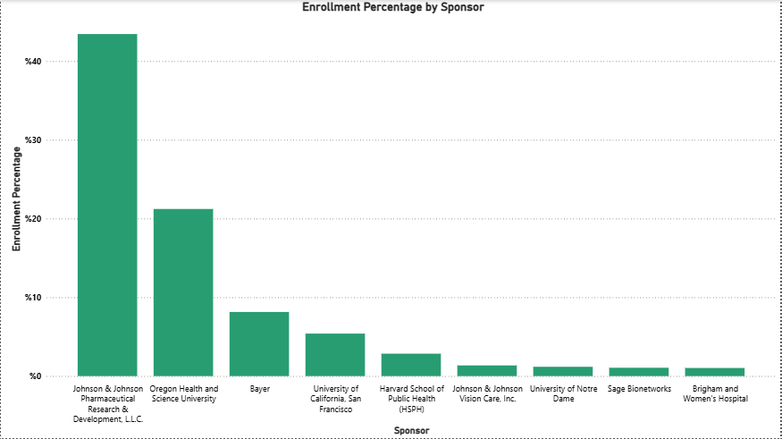
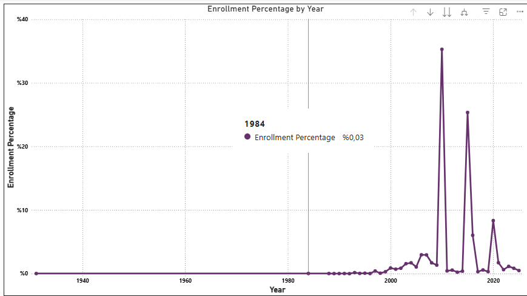
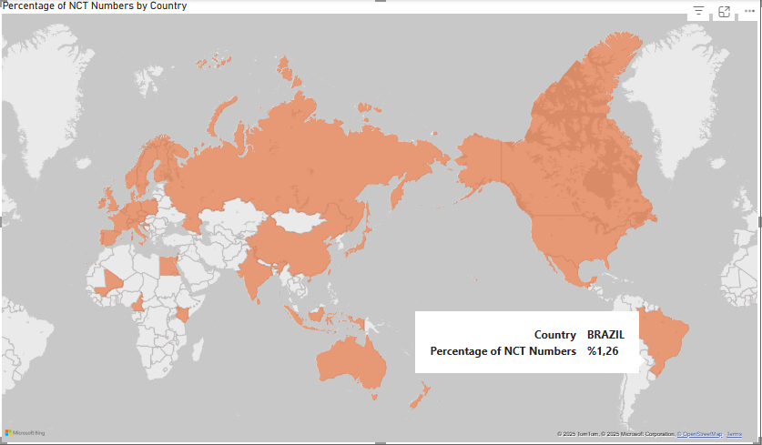
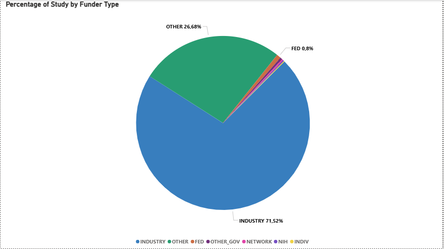
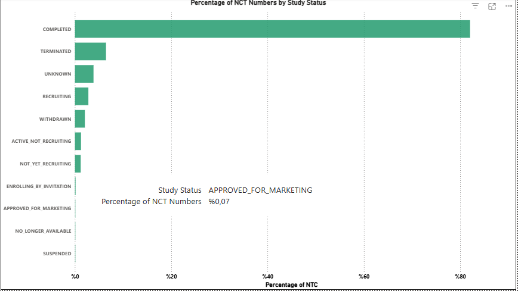

# 🧪 Clinical Trials Analysis – Python & Power BI  
# 🧪 Analisi degli Studi Clinici – Python e Power BI

This project analyzes Johnson & Johnson's global clinical trials through statistical and visual analysis using Python and Power BI. The dataset was extracted and saved from open data sources using the Python API. Data cleansing was performed on the extracted dataset, followed by a general analysis.
/  
Questo progetto analizza gli studi clinici globali condotti da Johnson & Johnson attraverso analisi statistiche e visive utilizzando Python e Power BI. Il set di dati è stato estratto e salvato da fonti di dati aperte utilizzando l'API Python. È stata eseguita una pulizia dei dati sul set di dati estratto, seguita da un'analisi generale.

---

##  Project Goals / Obiettivi del Progetto

- Analyze the **average duration** of clinical trials  
- Visualize **enrollment percentages** by sponsor and year  
- Compare **study status** by country  
- Display **study distribution** by funding source and status  
- Present interactive dashboards with **Power BI** and **Python** plots  
/
- Analizzare la **durata media** delle sperimentazioni cliniche
- Visualizzare le **percentuali di arruolamento** per sponsor e anno
- Confrontare lo **stato degli studi** per paese
- Visualizzare la **distribuzione degli studi** per fonte di finanziamento e stato
- Presentare dashboard interattive con grafici **Power BI** e **Python**

---

##  Tools & Libraries / Strumenti e Librerie

- Python (Pandas, Matplotlib, Seaborn)  
- Power BI  
- Jupyter Notebook  
- Visual Studio Code  
- CSV / Excel datasets  

---

##  Key Visualizations / Visualizzazioni Principali

#### 📌 Average Duration of Clinical Trials

#### 📌 Enrollment Percentage by Sponsor

#### 📌 Enrollment Percentage by Year

#### 📌 Percentage of Studies by Country

#### 📌 Percentage of Study by Funder

#### 📌 Percentage of Study by Status

#### 📌 Study Status by Country

---

##  Example Charts / Esempi di Grafici

###  From Python

  
*Average duration of clinical trials*  
*Durata media degli studi clinici*

  
*Study status by country*  
*Stato degli studi per paese*

---

##  Key Insights / Approfondimenti

- Clinical trials funded by **industry sponsors** tend to be **shorter**  
- **Public funders** dominate in certain regions (e.g., Europe, Latin America)  
- **Enrollment rates** vary year by year depending on global health needs  
- **Terminated studies** are more common in low-income regions  
/
- Gli studi clinici finanziati da **sponsor industriali** tendono ad essere **più brevi**
- I **finanziatori pubblici** dominano in alcune regioni (ad esempio, Europa, America Latina)
- I **tassi di arruolamento** variano di anno in anno a seconda delle esigenze sanitarie globali
- Gli **studi interrotti** sono più comuni nelle regioni a basso reddito

---

## Requirements / Requisiti

pandas
numpy
matplotlib
seaborn
jupyter
openpyxl
imbalanced-learn

